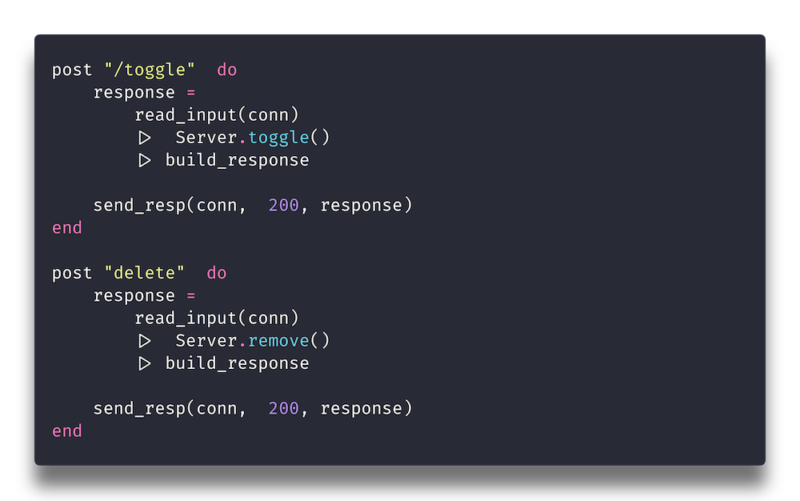

Oooooh-weeee, my first `blog` post!

```elixir
post "/toggle" do
  response =
    read_input(conn)
    |> Server.toggle()
    |> build_response

  send_response(conn, 200, response)
end
```

# This is a test.


